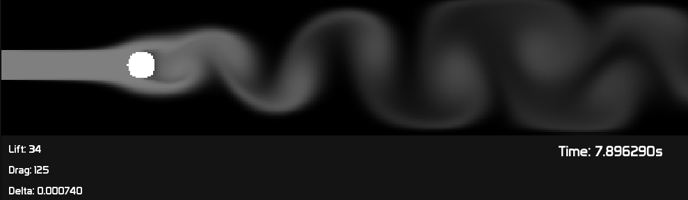
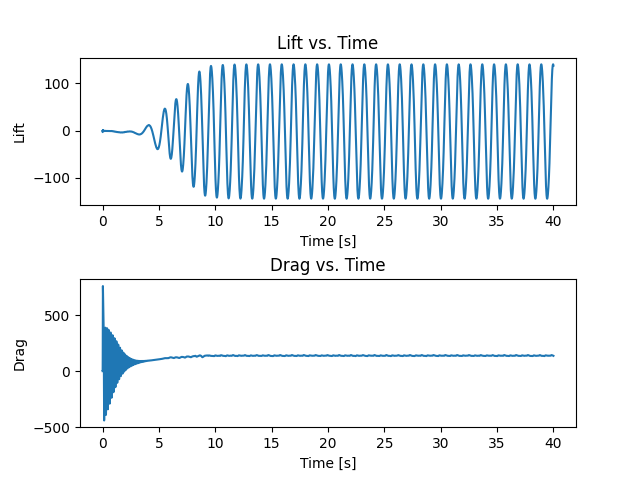

# Wind Tunnel
A wind tunnel simulation using Navier-Stokes equations. Project is built on top of my [Navier-Stokes library](https://github.com/gregora/Navier-Stokes).

## Showcase

### Sphere

A simulation of a sphere put in a wind tunnel. Above you can see a screenshot of the simulation and below the resulting graph of lift and drag.

The oscilating values for both lift and drag are a result of vortices behind the sphere.

The oscilations seem to have a frequency of 1.25Hz, however I did not investigate this further.

Raw data for this experiment is available in `data/sphere.csv`.

## Usage

### Dependencies
* SFML

### Compilation
Run `make` in the root directory.

### Running
Run `./main.out` in the root directory. The program supports the following command line arguments:
* `-object <object name>` - the object to simulate. Only use name of the file in `/objects/` folder
* `-energy` - shows the total energy of the system at each time step
* `-time <time>` - sets simulation time to `<time>` seconds
* `-velocities` - render velocity field together with smoke
* `-pressure` - wheter to render pressure or not. If pressure is not rendered, smoke is
* `-threads <threads>` - number of CPU threads to use
* `-render` - renders the system to a video file in the `render` directory as `output.mp4`
* `-auto` - automatically sets simulation delta as calculated via `max_delta()` function
* `-save <file name>` - saves simulation results as a csv file with columns `time, lift, drag`
